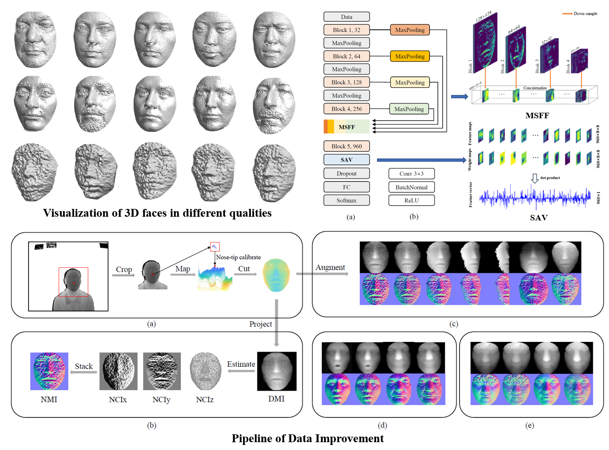

# Led3D
This project is an implementation for "Led3D: An lightweight and efficent deep approach to recognizing low-quality 3d faces"  [ [Download](http://openaccess.thecvf.com/content_CVPR_2019/papers/Mu_Led3D_A_Lightweight_and_Efficient_Deep_Approach_to_Recognizing_Low-Quality_CVPR_2019_paper.pdf) ], which is accepted by **CVPR2019**.



### TODO List

- Preprocessing (finished)

- Augmentation
- Inference

### Citation
```latex
@InProceedings{Mu_2019_CVPR,
author = {Mu, Guodong and Huang, Di and Hu, Guosheng and Sun, Jia and Wang, Yunhong},
title = {Led3D: A Lightweight and Efficient Deep Approach to Recognizing Low-Quality 3D Faces},
booktitle = {The IEEE Conference on Computer Vision and Pattern Recognition (CVPR)},
month = {June},
year = {2019}
}
```
